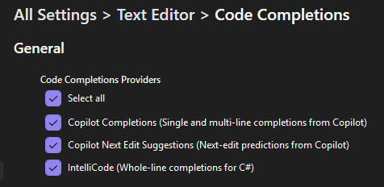

# Workshop setup

To complete this workshop you will need to clone a repository with a copy of the contents of this repository

> [!NOTE]
> Under regular conditions you would need to ensure all prequirements, but don't worry. We have ensured this environment as all you need.

## Install .github + MCP Extension

Before we begin, let's install the .github + MCP extension for Visual Studio. This extension provides access to GitHub MCP servers which we will use later in the lab.

1. [] Open Visual Studio 2026
1. [] Go to **Extensions -> Manage Extensions**
1. [] Search for **.github + MCP** in the search box
1. [] Click **Install** on the **G.github + MCP** extension by Mads Kristensen
1. [] Restart Visual Studio if prompted

> [!TIP]
> You can also install this extension from the [Visual Studio Marketplace](https://marketplace.visualstudio.com/items?itemName=MadsKristensen.GitHubNode). The .github + MCP extension is important because it provides the Node.js runtime required by some MCP servers, which you'll use in Part 9 of this lab.

## Configure GitHub Copilot - Personal Account

If you prefer to use your personal GitHub account instead of the Skillable lab account, follow these steps.

1. [] Open your browser and go to `https://github.com`.
1. [] Sign in with your personal GitHub account or create a new account if you don't have one.
1. [] Open Visual Studio 2026.
1. [] Select **Continue without code**, if prompted to sign-in, you can click Close.
1. [] Click the Copilot icon on the top bar (left side next to the search input box).
1. [] Click **Sign in to use Copilot**.
1. [] A browser window will open prompting you to sign in to GitHub and authorize Visual Studio and Copilot. Complete the sign-in and click **Authorize** when prompted.
1. [] When the browser shows the confirmation, click **open** to return to Visual Studio.
1. [] After setup you should see the **GitHub Copilot Walkthrough** tab and the Copilot button should be green.

    Note: Using your personal account is recommended if you want Copilot to access your own repositories, settings, and MCP authorizations. For the hands-on lab exercises that create or modify repository data via cloud agents, forking the lab repo into your own account gives the agents permission to operate on your fork.

## Turn on Copilot Settings

1.[] Ensure Code Completions and Next Edit Suggestions are enabled:
   - Go to the Code Completions settings in Visual Studio by heading to **Tools -> Options -> Text Editor -> Code Completions**
   - Ensure **Copilot Completions** is checked.
   - Ensure **Copilot Next Edit Suggestions** is checked.

   

1. Head to **Tools -> Options -> GitHub -> Copilot -> Copilot Chat** and ensure the following settings are enabled:
   - **Enable Planning**
   - **Enable View Plan Execution**
   - **Enable Copilot Coding agent (Preview)**

## Clone lab repository

For the full experience � especially if you plan to delegate tasks to cloud agents or allow Copilot to create issues and push changes � fork the repository to your own GitHub account and clone your fork. This gives the cloud agent permissions to operate on your copy of the repo.

1. [] In your browser, go to `https://github.com/dotnet-presentations/build-2025-lab300` and click **Fork** to create a fork under your GitHub account.
1. [] In Visual Studio, click **File -> Clone Repository**.
1. [] Enter the URL of your fork (for example `https://github.com/<your-username>/build-2025-lab300`) and press **Clone**.

If you prefer not to fork you can still clone the upstream repository directly:

1. [] In Visual Studio, click **File -> Clone Repository**.
2. [] Enter `https://github.com/dotnet-presentations/build-2025-lab300` and press **Clone**.

The code is now opened in Visual Studio, feel free to take a look at it or skip to the next section to start the app.

## Start the app

1. [] Open the **Solution Explorer** from the **View -> Solution Explorer** menu.
1. [] Set the **TinyShop.AppHost** as the startup project if it isn't by right clicking on the **TinyShop.AppHost** and selecting **Set as startup project**  and start the project with F5 or Debug -> Start Debugging from the menu.

    The .NET Aspire AppHost will start two applications and the .NET Aspire Dashboard:

    - The backend .NET app on **https://localhost:7130/api/Product**. 
    - The frontend Blazor app on **https://localhost:7085**. You can see the app by opening that URL from the dashboard

1. [] Stop debugging and close the application.

## Summary and next steps

You've now cloned the repository you'll use for this for the rest of the workshop.

---

[Back: Part 12 - Delegate to the Cloud](./part12-delegate-to-cloud.md)
